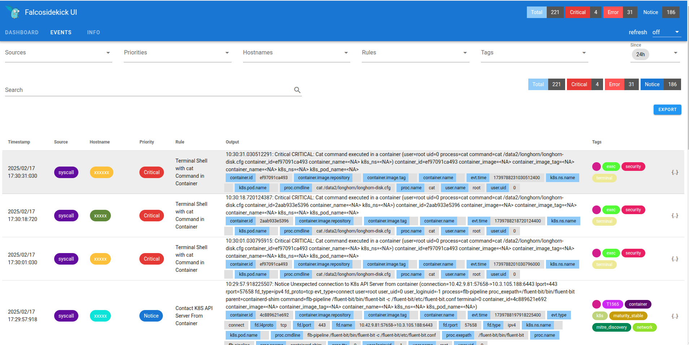

# Some custom for Falco
- Assume we installed falco to falco namespace

- Add custom rule:
```sh
helm upgrade falco falcosecurity/falco -n falco -f falco-values.yaml
```

- Uninstall: `helm uninstall -n falco falco`
- Just remove falco or falcosidekick: `helm delete falco`
# Install falco sidekick with custom value
- Direct value
```sh
helm install falcosidekick falcosecurity/falcosidekick \
  --set config.telegram.token="your_telegram_bot_token" \
  --set config.telegram.chatid="your_chat_id" \
  --set config.telegram.minimumpriority="error"
```

- Value from file
```sh
helm upgrade --install falcosidekick falcosecurity/falcosidekick -f falcosidekick.yaml -n falco
```

# Working Falco sidekick with outputs: Enabled Outputs: [WebUI Telegram]
```
2025/02/17 09:35:51 [INFO]  : Falcosidekick version: 2.31.1
2025/02/17 09:35:51 [INFO]  : Enabled Outputs: [WebUI Telegram]
2025/02/17 09:35:51 [INFO]  : Falcosidekick is up and listening on :2801
```

# Test output example with curl
```
curl -X POST http://localhost:2801/ \
  -H "Content-Type: application/json" \
  -d '{
    "output": "Test alert",
    "priority": "Error",
    "rule": "Test Rule",
    "time": "2025-02-17T12:00:00Z",
    "output_fields": {
      "evt.time": "2025-02-17T12:00:00Z",
      "proc.name": "curl",
      "user.name": "root"
    }
  }'
```

Example: 


# Access Falco UI
```
kubectl port-forward svc/falcosidekick-ui 2802:2802 --namespace falco
```

- Default user/pass is: `admin/admin`

- Some sample image with rule:




# Ref:
- https://github.com/falcosecurity/falcosidekick/blob/master/docs/outputs/telegram.md
- https://falco.org/docs/concepts/rules/custom-ruleset/
- https://artifacthub.io/packages/helm/falcosecurity/falco